  
  

---

## 🚀 Projects · 项目

  

---

## 🛠️ Tech Stack · 技术栈

  <!-- 追加方法：在 i= 后用逗号分隔追加图标 id，例如 i=git,github,py,java,react,ts。图标列表见 https://skillicons.dev -->
  

---

## 📊 GitHub Stats · 统计

  
  

  

---

## 🐍 Contribution Snake · 贡献贪吃蛇

  <!-- 需先运行 .github/workflows/snake.yml，生成 output 分支上的 snake.svg -->
  

---

  

